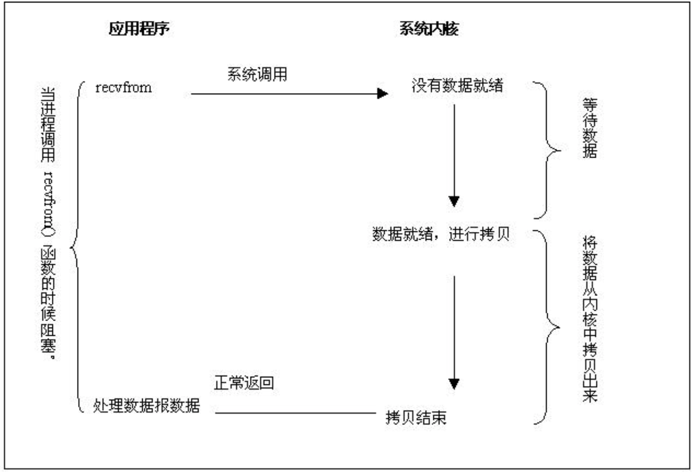
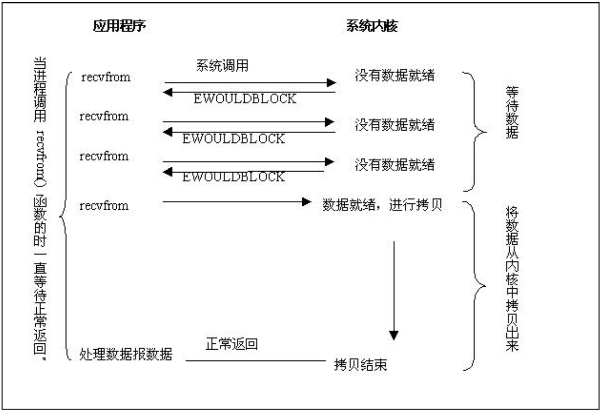
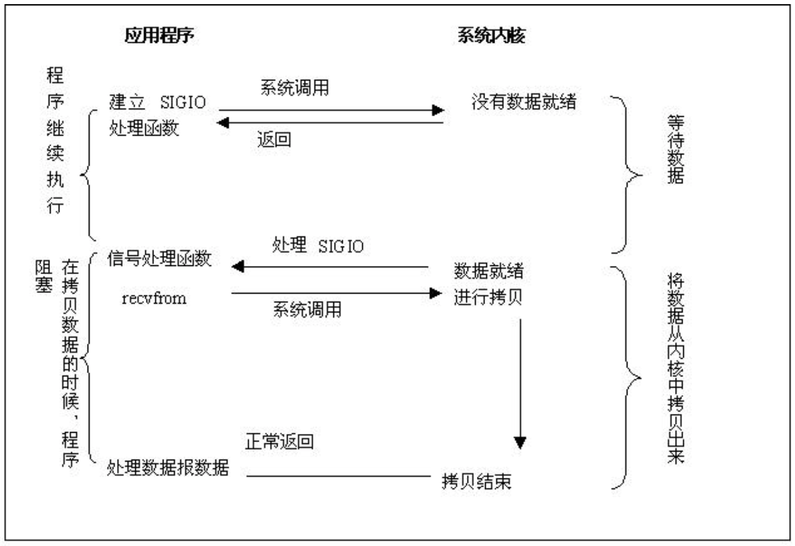
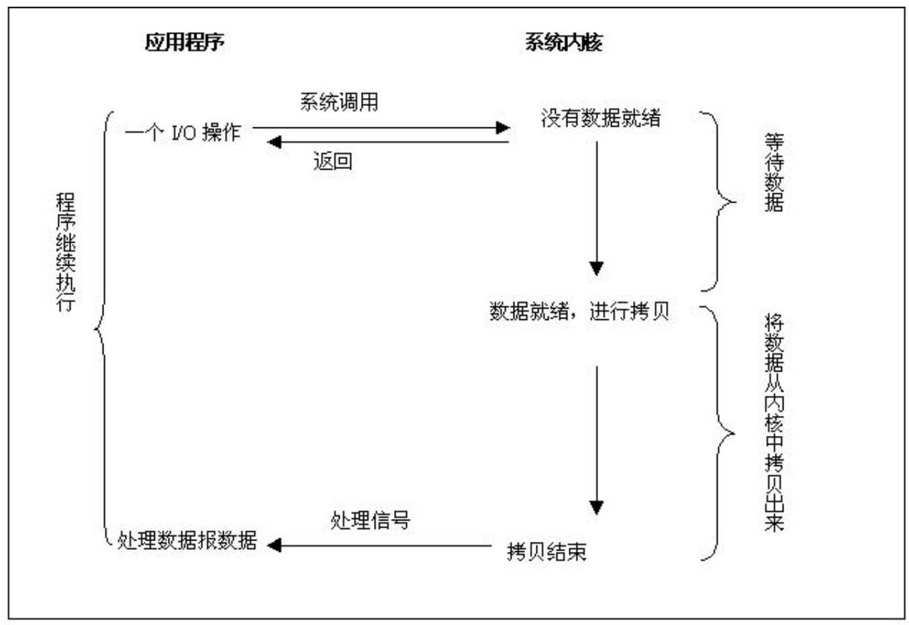

# 操作系统的轮询技术演进

> 操作系统对于I/O的处理通常是有两步
* 应用程序先发起系统调用待数据就绪
* 将数据从内核缓冲区拷贝到应用缓冲区

#### 同步阻塞IO

从应用程序开始系统调用->数据就绪，进行拷贝->拷贝结束，这之间应用程序都处于等待状态，不能做其它事情，直到将数据拷贝到用户空间或出错才返回，我们称之为阻塞I/O模式。

#### 同步非阻塞IO

相比于同步阻塞I/O模式，同步非阻塞I/O在每次调用之后，如果数据没有就绪就会立即返回，之后重复调用来检查I/O操作是否就绪，这对CPU资源是一个极其浪费的操作，直到数据就绪将数据从内核拷贝到用户空间，返回成功指示给到应用程序。

Read：就是一种实现，通过重复轮询I/O来判断。

#### IO多路复用

链接（Socket）并发大的情况，上面两种就不适合了，前面一个处理不完，后面就只能干等，这里就用到了I/O多路复用，下图所示相比较前两种，分为了两步，先进行select数据就绪后，在调用recvfrom进行真正的I/O读写操作。它的高级之处还在于能够一个线程同时处理多个Socket。

I/O多路服用有多种实现模式：`select`、`poll`、`epoll`、`kqueue`

- **select**

通过轮询检查在文件描述符上设置的标识位来进行判断，Select的轮询相当于在数据库中查找一条记录没有建立索引，对所有的Socket进行全部遍历，这对CPU是浪费的。另外Select还有一个限制，对于单个进程所能打开的文件描述符最大只能是1024，那么基于Select的轮询技术最多也只能很好的处理1000并发的吞吐量，可以查看[上一个10年，著名的C10K并发连接问题](http://www.52im.net/thread-566-1-1.html)

- **poll**

poll和select在实现上没有本质的区别，相比较select，poll基于链表来实现，没有了最大链接1024的限制。但是当文件描述符多了之后，每次调用都会对链接进行线性遍历，性能还是十分低下的。

- **epoll**

是linux下效率最高的I/O事件通知机制，没有最大链接限制，通过callbak回调通知机制，不在是每次调用都对链接进行线性遍历，这样就不会随着文件描述符的增加导致效率下降。

在1GB内存的机器上能监听大约10万个端口，远超过select的1024限制，具体可以在服务器上查看`cat /proc/sys/fs/file-max`

- **kqueue**

与epoll类似，仅存于FreeBSD（一种类UNIX操作系统）。

#### 信号驱动IO

仅在Unix上支持，与I/O多路复用相比避免了select的阻塞轮询。应用程序进行系统调用后立即返回，处理其它事物，在数据就绪之后系统会发送一个SIGIO信号到应用程序，应用进程开始读取数据。

#### 异步IO模型

异步I/O模型是目前最理想的一种形式，应用程序发起系统调用后无需等待直接返回当前调用状态，进行后续的其它任务，结果由内核完成I/O操作之后通过回调通知到我们的应用程序，中间没有阻塞过程。

在Linux2.6之后增加了异步I/O的实现方式 **`AIO`**，但是很少系统能够实现。

#### select和epoll的区别

> 如果问到轮询技术的实现一般也会考察select和epoll的区别
- 在操作方式上select采用了线性遍历来查找，链接多了之后可以想象一下在一个诺大的数组中每次通过遍历来锁定一个链接，是多么的消耗性能。epoll则不需要遍历，采用的是回调机制，可以看作一个HashTable，来锁定一个对象是很快的。对于文件描述符（最大连接数）select限制为1024，epoll则没有这个限制，通常在1G内存的机器上所能支持的连接数为10W左右。
- 操作系统支持上来看，目前流行的高性能Web服务器Nginx是基于epoll来实现高并发，当然如果你的链接很小的情况下区别还是不大的select也能满足，如果是大流量、高并发情况epoll目前还是首选模型。